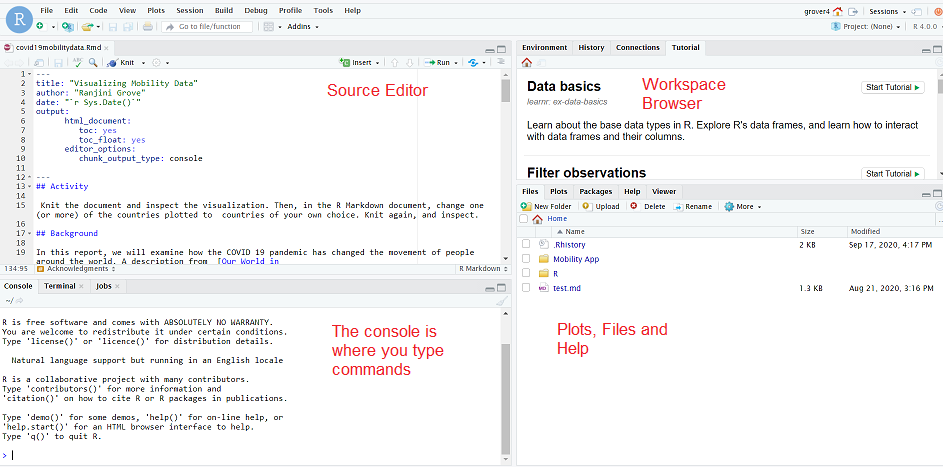
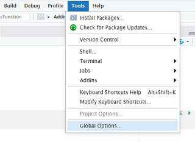
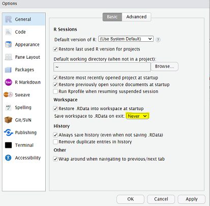
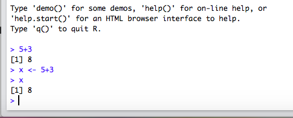
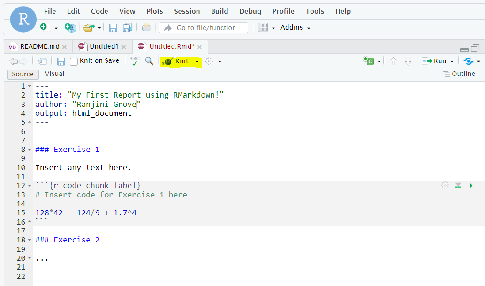

```{r global_options, include=FALSE}
knitr::opts_chunk$set(eval = FALSE)
library(tidyverse)
library(openintro)
```
<div id="boxedtext">
**Learning Objectives**

- Become familiar with the RStudio Interface.
- Learn how to record written explanations and code chunks in an RMarkdown file and ``knit`` the file into a report.
- Run some basic commands in R as a calculator.
</div>

Today, we  will require you to run some very basic commands in R. You will explore the various windows in the user-friendly RStudio interface as you do so. You will also practice recording your answers in an RMarkdown report and submitting the report on Canvas. 


* * *

## Getting Started 


Click here  to access [Rstudio on JupyterHub]( https://jupyter.rttl.uw.edu/2022-summer-upward-bound-stat/user-redirect/rstudio){target="_blank"}. It's just that simple! Enter your UW NETID and password and you're in. You do not need to install R or RStudio on your laptop, but it is freely available and if you wish to have a local installation of the program, please scroll to the **Downloading R and RStudio** section at the end of the document.

### The RStudio Interface

The goal of this activity is to introduce you to R and RStudio, which you will be using throughout the course both to learn the statistical concepts discussed in the course and to analyze real data and come to informed conclusions.
To clarify which is which: `R` is the name of the programming language itself and RStudio is a convenient interface for working with `R` .

### The Panes of RStudio

Rstudio has four main panes, each occupying about a fourth of your screen as shown below. 



Generally, we will be writing programs that are more than a few lines in length. The **Source Editor** can help you open, edit and execute these programs. Users who are using the editor for the first time today will not see this window until they actually use it for the first time.


The pane on the lower left is called the **Console** or the command line. This is where you can type code that executes immediately.   Every time you launch RStudio, it will have the same text at the top of the 
console telling you the version of R that you're running. Below that information you will see the symbol $>$. This is called the *prompt*: 
it is a request for a command. Initially, interacting with R is all about typing commands into the console
and interpreting the output. 


The pane in the upper right contains your **Workspace**, which will show you all of your named variables and datasets once you create/load them. You can also view a *history* of all commands you have previously entered in the console. 

Any plots that you generate will show up in the pane in the lower right corner. This is also where you can browse your files, access help, manage packages, etc.

**Play around with the minimize and maximize buttons on the top right of the panes to get a feel for the different windows** 

### First Things, First

Please select Tools from the top bar, then Global Options:



and choose the option to *never* save your workspace. 



This will ensure that you start off with a fresh workspace each time you open RStudio. This way, you are not accidentally working with stale definitions of variables defined in older sessions. As you become more comfortable, you can also customize the appearance of the interface to make it easier to read and work in.

<!--- ### R packages

`R` is an open-source programming language, meaning that users can contribute R code that make our lives easier, and we get to use them for free. In R, the shareable code is called a **package**.


For this lab, and many others in the future, we will use the following packages:

 - tidyverse (suite of data wrangling and visualization packages)
 
 - openintro (data and custom functions from our text)

In the lower right hand pane click on the *Packages* tab.
Type the name of each of these packages (tidyverse, openintro) into the search box to see if they have been installed. **If you are on the RStudio server, the tidyverse and openintro packages have already been installed for you. You're welcome!**
If these packages do not appear when you type in their name in the search bar, install them by copying and pasting or typing the following two lines of code into the console of your RStudio session.
Be sure to press enter/return after each line of code.


```{r install-packages, message = FALSE, eval=FALSE}
install.packages("tidyverse")
install.packages("openintro")
```
**Don't worry if tons of text prints in your console while you run these lines of code.** 

You only need to *install* packages once, but you need to *load* them each time you relaunch RStudio.
We load packages with the `library` function.
Copy and paste or type the the following two lines in your console to load the tidyverse and openintro packages into your working environment.

```{r , message = FALSE}
library(tidyverse)
library(openintro)
```


--->

## Your first R commands

You can interact with RStudio in the console window as you would interact with any scientific calculator. Some common mathematical operations along with the corresponding symbols are shown below.

|**R Symbol**|**Operation**|
|:---: | :---: |
| `+` | addition|
| `-` | subtraction|
| `/` | division|
|`*`  | multiplication|
|`^` or `**`| exponentiation|

These can be used together in parentheses `()` to determine the order of operations (PEMDAS).

We also have access to a wide variety of mathematical functions that are already built into R. Some examples are below.

|**R Symbol**| **Description**|**Math symbol**|
|:---: |:---: |:---: |
|`sqrt(x)` | square root| $\sqrt{x}$ |
|`exp(x)`  | exp| $e^{x}$ |
|`log(x)`  | natural log | $\ln(x)$ | | 


There are other operators that we will use that are not mathematical in nature, but they are nevertheless crucial for the use of R.

|**R Symbol**| **Description** | **Example**|
|:---:  |:---: |:---: |
|`#`    | comment | \# this is a comment, not code |
|`<-`   | assignment | `x <- 5` |


To make sure that everything is up and running properly, let's start in the console. Anything that you type at the prompt `>`  will be executed. For example, type ``5+3`` at the prompt and then press enter (return). You should see your answer right away. 

You can create new objects using the assignment operator `<-`. For example, type ``x <- 5+3`` which can be read as `x gets 5 plus 3`. The console will no longer print out ``8``, but it will save your value of ``x``.  Now type ``x`` in the console and hit enter; verify that it prints the appropriate value. 




Let's try out a few calculations to get a feel for R as a calculator. <!--- The following exercises are marked as **Quiz Questions**. This means that you will not only record the answer in your R session, but you will also submit the answer on the corresponding Canvas check-in quiz. The Canvas quiz is auto-graded and will count towards your lab participation score. ---> The following questions get progressively difficult. Work each one out in the Console window using R as a calculator.

<!--- Complete the following exercises and enter answers in the CANVAS quiz as you go along. They get progressively difficult, so feel free to ask for help if you are stuck. ---> 

1. Compute $128 \times 42 - \frac{145}{9} + 1.7^4$. 

2. Find the square root of 1127. 

3. Body Mass Index (BMI) is an indicator of body fat, which is related to the risk of disease and death. BMI is calculated from your weight (in kilograms) and height (in meters) using the formula:
$BMI = \frac{kg}{m^2}.$
Calculate the BMI for a person with weight 70 kilograms and height 1.7 meters. 

In case you're wondering: 1 kg $\approx$ 2.2 lb, 1 m $\approx$ 3.3 \:ft. To stretch yourself, calculate their weight in pounds and height in feet, so you have some context on how tall this person is and how much they weigh in units that are likely more familiar to you.

4. The formula for the sum of the integers from 1 to $n$ (called natural numbers) is $\frac{n (n+1)}{2}$. Assign a value of 100 to $n$ and then use R to compute the sum of 1 through 100 using the formula. What is the sum?


5. Assume one is HIV negative. The estimated risk of contracting HIV by sharing needles $d$ times with an HIV-infected person is $1 - (1-p)^d$, where $p$ is the probability of infection per time. Calculate $p$ if the risk of being infected after $d=365$ times is 91.4\%. That is, solve for $p$ in the equation
$$ 1 - (1-p)^{365} = 0.914.$$

* * *

## Creating a reproducible report

Anything that you could ever want to calculate in R can be done directly in the console. However, if you are writing commands that you might want to revisit later or share with others, or if you need to include a narrative or explanation along with your calculations, you will need to work inside a file, rather than in the console. 


An **RMarkdown** file lets you intersperse *chunks* of R code with  text and outputs the result as a nicely formatted document. In this course, we will use RMarkdown to create lab reports and for homework assignments. The following [video](https://youtu.be/lNWVQ2oxNho) describes the advantage of RMarkdown files for creating reproducible reports. 


Follow these instructions to create your first "report" in RMarkdown. 

<!---

* From the toolbar in RStudio, select `File` -> `New File` -> `R Markdown`

* You will be prompted for the name of the report and also a new folder (directory) to save the report in. Be very intentional about choosing a descriptive filename that describe the content. For example,  `hello-world` would be a good choice for the filename and you could save it in the `live-coding` folder.


--->

 
* Open the document `intro-to-r.Rmd` in the `live-coding` sub-folder on JupyterHub. 

* A sample document should pop up (see image below). In the parts of the document with a white background, you may type anything you want as you would in a word document. In the parts of the document with a gray background, you can type R code as you would type it in the console. 


Note that 
 
 - when used on white background, the `#` symbol creates titles and headers that show up in large font in the output document. We use text such as `### Exercise 1` to label the exercises. However, when used inside  a code chunk, the `#` symbol in R creates a code **comment**.  This can be used to write regular text inside of a code chunk. Any text written in a code chunk after the `#` symbol is ignored; it is not run as R code. 

### Entering and running code in RMarkdown files

<!--- Right now, the only text in the grey boxes in your template file is comments, and so you haven't actually written any code. ---> 

Go ahead and write your name in the header where it says YOUR NAME and then write the code for Exercise 1 in the first code chunk as shown in the image below.


Just typing the code in the gray chunk is not enough. Now we need to run this code. First note that the entire document is automatically *run* each time you knit your document. **Knit** your document now to try this out! Did it print your answer? 



You can knit your R Markdown file every time you write a new line of code, but sometimes the knitting process takes a few minutes and you just want to run a few lines at a time **in the console** to make sure they are working. You can do this by

-   placing your cursor on the specific line of code and pressing `Ctrl-Enter` or `Cmd-Enter`
-   placing your cursor on the specific line of code and pressing the "Run" button in the upper right hand corner of the R Markdown file, or
-   by clicking on the green arrow at the top right hand corner of the code chunk

Any of these options should copy and paste your code from your  file into the console window and run it. Try it.

Repeat the process above for exercises 2 - 5 from the earlier section. Create code chunks for each new exercise beginning with Exercise 2. Giving each chunk a descriptive name is helpful for debugging purposes, and is a good habit to form. So is commenting each meaningful line of code. Finally, feel free to add notes to help you recall how to solve the exercises you found especially hard. 


### Common error

When an R Markdown document is knitting, it only has access to the variables that are created inside of the R Markdown document itself. The R Markdown document does not get to use variables that are created in the **console**.  To illustrate this concept, run the following two lines of code in your **console**.

```{r}
x<-2
x*3
```

The lines should work fine, and 6 should be printed. Now, try putting the code `x*3` into a code chunk in your R Markdown document, and knit the document. What happened? Why did this happen? 


***

## Additional Practice

Variables in R can be more than just numbers! If there is time left in section, play around with the following lines of code in your console. You do not need to turn anything in for this part of the assignment, and if you don't get to it during section you do not need to worry about it. 

First, let's explore what happens when we work with character strings in R. We use quotes to denote values of character variables. Does it make sense to add two variables when they are not numbers? 

```{r, eval=FALSE}
x <- "cat"
y <- "dog"
x+y
```

In statistics, we often are not working with one number at a time. We are often working with lists of numbers; datasets! We can make our first small dataset in R using the `c()` function, which binds elements together in a **vector**. Discuss the following lines of code as a group.

```{r, eval=FALSE}
data <- c(1,5,7,8,9,10,12,13) 
mean(data)
data+5
mean(data+5)
data[3]
```


## Ending Your Session

Congratulations! You made it through your first R session! 


Your report (.Rmd) and the html (.html) output file should remain in your directory on the server, so long as you saved them. Let's now practice uploading both files in CANVAS. 

First, go ahead and download a copy to your computer:

 - check the box(es) corresponding to the file(s) in the Files pane. 
 - From the drop down menu in the pane select More -> Export. 

By default, all downloads end up in the **Downloads** folder on your laptop. I would suggest that you create a folder called `summer-academy` on your machine with a subfolder called `live-coding`. Move the files to this sub-folder. 

Upload your files (both the `.Rmd` and `.html`) from your computer to the associated CANVAS assignment [dropbox](https://uwmsub.instructure.com/courses/68/assignments/485) by the due date!


To quit RStudio, type `q()` in the console window or click `r knitr::include_graphics("img/stop.PNG")`
 on the top right. Then close the tab on your browser and you are done!

### Help! I'm stuck! 

For help during the "live" session, please raise your hand to alert the instructor. If you are trying this on your own at home, please post an SOS on our Discussion board!! <!---For asynchronous help, please first view the recording of your section. If that still does not help, please post your questions on Ed.  ---> 

## Downloading R and RStudio

If you have downloaded R and RStudio for another course in the past, please still follow the instructions below to ensure that you have download the most recent versions. You are not required to download R on your laptop for this course.

The programming language itself is called R and RStudio is a user friendly interface for working with R.  Download the **most recent version of R** and download the free version of RStudio Desktop.

* http://cran.r-project.org/
* http://www.rstudio.com/ide/download/desktop (pick the free version of RStudio Desktop)

For both R and RStudio, you must **follow the instructions that are appropriate for your operating system** (if you have a Mac, pick the Mac version. Likewise for windows). 

Open up Rstudio as you would any application. **Make sure you open Rstudio and not R**.

If you are unable to open RStudio, try to visit a TA in office hours.   


## Acknowledgements.

This tutorial was adopted from OpenIntro and has been edited by several STAT 311 TAs and the instructor. 
<div id="license">
This is a product of OpenIntro that is released under a 
[Creative Commons Attribution-ShareAlike 3.0 Unported](http://creativecommons.org/licenses/by-sa/3.0). 
This lab was adapted for OpenIntro by Andrew Bray and Mine &Ccedil;etinkaya-Rundel
from a lab written by Mark Hansen of UCLA Statistics.
</div>