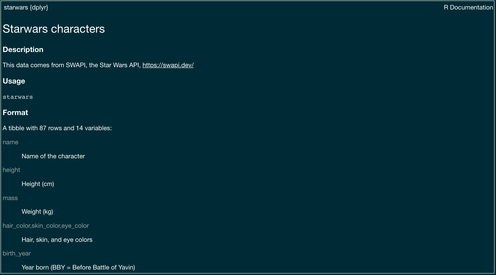
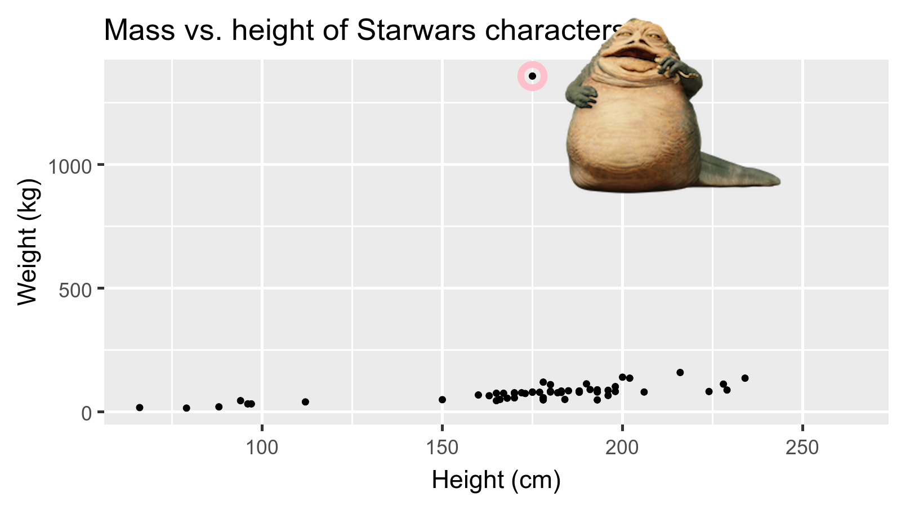

```{r child = "../setup.Rmd"}

```

```{r packages,  include=FALSE}
library(tidyverse)
library(magick)
library(countdown)
knitr::opts_chunk$set(echo = TRUE)
 
```

class: middle

# What is in a dataset?

---

## Dataset terminology

- Each row is an **observation**
- Each column is a **variable**


```{r message=FALSE}
starwars
```


---

## Luke Skywalker


---

## What's in the Star Wars data?

Take a `glimpse` at the data:

```{r}
glimpse(starwars)
```

---

.question[
How many rows and columns does this dataset have?
What does each row represent?
What does each column represent?
]

```{r eval = FALSE}
?starwars
```

```{r echo=FALSE}

```

---

.question[
How many rows and columns does this dataset have?
]

.pull-left[
```{r}
nrow(starwars) # number of rows
ncol(starwars) # number of columns
dim(starwars)  # dimensions (row column)
```
]

---

class: middle

# Exploratory data analysis

---

## What is EDA?

- Exploratory data analysis (EDA) is an approach to analysing data sets to summarize its main characteristics
- Often, this is visual -- this is what we'll focus on first
- But we might also calculate summary statistics and perform data wrangling/manipulation/transformation at (or before) this stage of the analysis -- this is what we'll focus on next

---

## Mass vs. height

.question[ 
How would you describe the relationship between mass and height of Starwars characters?
What other variables would help us understand data points that don't follow the overall trend?
Who is the not so tall but really chubby character?
]

```{r fig.width = 8, warning = FALSE, echo=FALSE, out.width = "50%"}
ggplot(data = starwars, mapping = aes(x = height, y = mass)) +
  geom_point() +
  labs(title = "Mass vs. height of Starwars characters",
       x = "Height (cm)", y = "Weight (kg)") +
  geom_point(data = starwars %>% filter(name == "Jabba Desilijic Tiure"), size = 5, pch = 1, color = "pink", stroke = 3)
```

---

## Jabba!

```{r echo = FALSE, warning = FALSE, cache = TRUE, out.width = "80%"}
jabba <- image_read("img/jabba.png")
fig <- image_graph(width = 1600, height = 900, res = 200)
ggplot(data = starwars, mapping = aes(x = height, y = mass)) +
  geom_point() +
  labs(title = "Mass vs. height of Starwars characters",
       x = "Height (cm)", y = "Weight (kg)") +
  geom_point(data = starwars %>% filter(name == "Jabba Desilijic Tiure"), size = 5, pch = 1, color = "pink", stroke = 3)
dev.off()
out <- fig %>% image_composite(jabba, offset = "+1000+30")
image_write(out, "img/jabbaplot.png", format = "png")

```

---

class: middle

# Data visualization

---

## Data visualization

> *"The simple graph has brought more information to the data analyst's mind than any other device." --- John Tukey*
- Data visualization is the creation and study of the visual representation of data
- Many tools for visualizing data -- R is one of them
- Many approaches/systems within R for making data visualizations -- **ggplot2** is one of them, and that's what we're going to use

---

## ggplot2 

.pull-left[
```{r echo=FALSE, out.width="80%"}
knitr::include_graphics("img/ggplot2.jpg")
```
] 
.pull-right[ 
- **ggplot2** is an R package <sup>1</sup>. 
- `gg` in "ggplot2" stands for Grammar of Graphics 
- Inspired by the book **Grammar of Graphics** by Leland Wilkinson
]

.footnote[<sup>1</sup>code/data/documentation that is bundled together so it is easy to share with others
]
---
## Hello ggplot!

.pull-left-wide[
- `ggplot()` is the main function in ggplot2
- Plots are constructed in layers
- Structure of the code for plots can be summarized as

```{r eval = FALSE}
ggplot(data = [dataset], 
       mapping = aes(x = [x-variable], y = [y-variable])) +
   geom_xxx() +
   other options
```

- To use the **ggplot2** package, we must first install it. Once installed, simply type:

```{r}
library(ggplot2)
```

to use it. 
]
---

## Mass vs. height

```{r mass-height, fig.width = 8, out.width = "50%"}
ggplot(data = starwars, mapping = aes(x = height, y = mass)) +
  geom_point() +
  labs(title = "Mass vs. height of Starwars characters",
       x = "Height (cm)", y = "Weight (kg)")
```

---

.question[ 
- What is the dataset being plotted?
- Which variables map to which features (aesthetics) of the plot?
- What does the warning mean?<sup>+</sup>
]

```{r ref.label="mass-height", fig.show = "hide"}
```

.footnote[
<sup>+</sup>Suppressing warnings in subsequent slides to save space
]

---

class: inverse, bottom
background-image: url("img/penguins.png")
background-size: cover
 
# Let's Dive In

---
class: top

.left-column[#`r fontawesome::fa(name="laptop-code", fill="white")`]
.right-column[

1. .left[ Log in to [https://ranjini-grove.shinyapps.io/ggplot/]( https://ranjini-grove.shinyapps.io/ggplot/)]

1. .left[ Work through the `ggplot` tutorial]


]


 `r countdown(minutes=40, seconds=0)`


