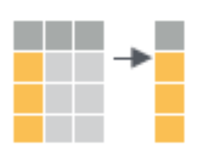
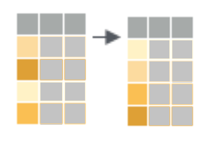
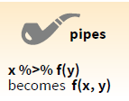
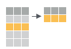
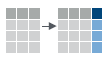
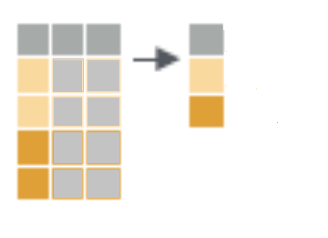
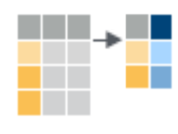

```{r child = "../setup.Rmd"}
```


```{r packages, echo=FALSE, message=FALSE, warning=FALSE}

library(countdown)
library(tidyverse)
library(skimr)
library(fontawesome)
library(reactable)

```


class: middle

#A Grammar of Data Manipulation

---

## dplyr

... based on the concepts of functions as verbs that manipulate data frames

.pull-left[
```{r dplyr-part-of-tidyverse, echo=FALSE, out.width="70%", caption = "dplyr is part of the tidyverse"}
knitr::include_graphics("img/dplyr-part-of-tidyverse.png")
```
]
.pull-right[
.midi[
- `select`: pick columns by name
- `arrange`: reorder rows
- `slice`: pick rows using index(es)
- `filter`: pick rows matching criteria
- `distinct`: filter for unique rows
- `mutate`: add new variables
- `summarise`: reduce variables to values
- `group_by`: for grouped operations
- ... (many more)
]
]

---

## Rules of **dplyr** functions

- First argument is **always** a data frame
- Subsequent arguments say what to do with that data frame
- Always returns a data frame
- Doesn't modify the original data frame

---

## Data: Hotel bookings 

- 1000 bookings from two hotels: one resort and one city hotel 
<!--- - Goal for original data collection: Development of prediction models to classify a hotel booking's likelihood to be cancelled ([Antonia et al., 2019](https://www.sciencedirect.com/science/article/pii/S2352340918315191#bib5)) --->


```{r echo=FALSE, message=FALSE}
set.seed(14)
hotels <- readr::read_csv('https://raw.githubusercontent.com/rfordatascience/tidytuesday/master/data/2020/2020-02-11/hotels.csv')
hotels <- slice_sample(hotels, n=1000)
```


```{r echo=F }
rmarkdown::paged_table(hotels)
```

---
class: middle

# Select

---
## Select: what it does

```{r echo=FALSE, out.width="40%", fig.align="center"}

```

.footnote[[Rstudio dplyr cheatsheet ](https://github.com/rstudio/cheatsheets/blob/master/data-transformation.pdf)]
---
## Select a single column

View only `lead_time` (number of days between booking and arrival date):

```{r}
select(hotels, lead_time)  
```

---

## Select a single column

.pull-left[
```{r eval=FALSE}
select( #<<
  hotels, 
  lead_time
  )
```
]
.pull-right[
- Start with the function (a verb): `select()`
]

---

## Select a single column

.pull-left[
```{r eval=FALSE}
select( 
  hotels, #<<
  lead_time
  )
```
]
.pull-right[
- Start with the function (a verb): `select()`
- First argument: data frame we're working with , `hotels`
]

---

## Select a single column

.pull-left[
```{r eval=FALSE}
select( 
  hotels, 
  lead_time #<<
  )
```
]
.pull-right[
- Start with the function (a verb): `select()`
- First argument: data frame we're working with , `hotels`
- Second argument: variable we want to select, `lead_time`
]

---

## Select a single column

.pull-left[
```{r}
select( 
  hotels, 
  lead_time
  )
```
]
.pull-right[
- Start with the function (a verb): `select()`
- First argument: data frame we're working with , `hotels`
- Second argument: variable we want to select, `lead_time`
- Result: data frame with `r nrow(hotels)` rows and 1 column
]

---

.tip[
dplyr functions always expect a data frame and always yield a data frame.
]

```{r}
select(hotels, lead_time)
```

---
## `select` multiple columns

View `lead_time` and `hotel` type:

```{r}
select(hotels, hotel, lead_time)
```

---
## `select` to exclude variables


```{r output.lines=18}
select(hotels, -agent) #<<
```


---

## `select` a range of variables

```{r}
select(hotels, hotel:arrival_date_month) #<<
```

---

## `select` variables with certain characteristics

```{r}
select(hotels, starts_with("arrival")) #<<
```

---

## `select` variables with certain characteristics

```{r}
select(hotels, ends_with("type")) #<<
```

---

## Select helpers

- `starts_with()`: Starts with a prefix
- `ends_with()`: Ends with a suffix
- `contains()`: Contains a literal string
- `num_range()`: Matches a numerical range like x01, x02, x03
- `one_of()`: Matches variable names in a character vector
- `everything()`: Matches all variables
- `last_col()`: Select last variable, possibly with an offset
- `matches()`: Matches a regular expression (a sequence of symbols/characters expressing a string/pattern to be searched for within text)

.footnote[
See help for any of these functions for more info, e.g. `?everything`.
]

---
class: middle

# Arrange
---
## Arrange: what it does

```{r echo=FALSE, out.width="40%", fig.align="center"}


```

---
## `arrange` in ascending order

```{r eval=F}
arrange(hotels, lead_time) #<<
```


```{r echo=F}

rmarkdown::paged_table(arrange(hotels, lead_time))
```

---
## `arrange` in descending order


```{r eval=F}
arrange(hotels, desc(lead_time) ) #<<
```

```{r echo=F}

rmarkdown::paged_table(arrange(hotels, desc(lead_time)))
```
---
## `arrange` on character variables

```{r eval=F} 
arrange(hotels, hotel)
```


```{r echo=F} 
rmarkdown::paged_table(arrange(hotels, hotel))
```
---

## Select, then arrange

.question[
What if we wanted to select `hotel` and `lead_time`, and then arrange the data in decreasing order of `lead_time`?
]

--

```{r  output.lines=7}

arrange(select(hotels, hotel,lead_time), desc(lead_time) )
```


---

class: middle

# Pipes


```{r echo=FALSE, out.width="40%", fig.align="center"}

```
---
## What is a pipe?

The pipe gives us an alternate way of supplying the first argument to a function. 

--
.pull-left[ 
- Start with the `select` function and pass on the result to `arrange`,
]

--
.pull-right[

```{r}
select(hotels, hotel, lead_time) %>% 
    arrange(desc(lead_time) )
```


]

---
## Why pipe?


- Writing it out using pipes gives it a more natural (and easier to read) 
structure:

**Without pipe**

```{r eval=FALSE}
arrange(select(hotels, hotel,lead_time), desc(lead_time) )
```


**With pipe**

```{r eval=FALSE}

select(hotels, hotel, lead_time) %>% 
    arrange(desc(lead_time) )

```


---
## Piping it all the way

.pull-left[
- Start with the data frame `hotels`, and pass it to the `select()` function,
]
.pull-right[

```{r}
hotels %>% #<<
  select(hotel, lead_time) 
```
]


---

## Piping it all the way

.pull-left[
- Start with the data frame `hotels`, and pass it to the `select()` function,
- then we select the variables `hotel` and `lead_time`,
]
.pull-right[

```{r}
hotels %>%
  select(hotel, lead_time) #<<

```

]

---
## Piping it all the way

.pull-left[
- Start with the data frame `hotels`, and pass it to the `select()` function,
- then we select the variables `hotel` and `lead_time`,
- and then we arrange the data frame by `lead_time` in descending order.
]
.pull-right[

```{r}
hotels %>%
  select(hotel, lead_time) %>% 
     arrange(desc(lead_time)) #<<
```
]


???
.tip[
In R, you can use the `#` for adding comments to your code. 
Any text following `#` will be printed as is, and won't be run as R code.
This is useful for leaving comments in your code and for temporarily disabling 
certain lines of code while debugging.
]


```{r output.lines=10}
hotels %>%
  #arrange columns                    # this line is a comment
  #select( hotel, lead_time ) %>%      # this one doesn't run
  arrange(desc(lead_time))             # this line runs
```

???

## Aside

The pipe operator is implemented in the package **magrittr**, though we don't need to load this package explicitly since **tidyverse** does this for us.


## How does a pipe work?

- You can think about the following sequence of actions - find keys, start car, drive to work, park.


- Expressed as a set of nested functions in R pseudocode this would look like:
```{r eval=FALSE}
park(drive(start_car(find("keys")), to = "work"))
```


- Writing it out using pipes give it a more natural (and easier to read) 
structure:
```{r eval=FALSE}
find("keys") %>%
  start_car() %>%
     drive(to = "work") %>%
        park()
```

---

## A note on piping and layering

- `%>%` used mainly in **dplyr** pipelines, *we pipe the output of the previous line of code as the first input of the next line of code*


- `+` used in **ggplot2** plots is used for "layering", *we create the plot in layers, separated by `+`*


## dplyr

.midi[
`r emo::ji("x")`

```{r error=TRUE}
hotels +
  select(hotel, lead_time)
```

`r emo::ji("white_check_mark")`

```{r eval=FALSE}
hotels %>%
  select(hotel, lead_time)
```

```{r echo=FALSE, output.lines=6}
hotels %>%
  select(hotel, lead_time)
```
]


## ggplot2

.midi[
`r emo::ji("x")`

```{r error=TRUE}
ggplot(hotels, aes(x = hotel, fill = deposit_type)) %>%
  geom_bar()
```

`r emo::ji("white_check_mark")`

```{r out.width="25%"}
ggplot(hotels, aes(x = hotel, fill = deposit_type)) +
  geom_bar()
```
]


## Code styling

Many of the styling principles are consistent across `%>%` and `+`:

- always a space before
- always a line break after (for pipelines with more than 2 lines)

`r emo::ji("x")`

```{r eval=FALSE}
ggplot(hotels,aes(x=hotel,y=deposit_type))+geom_bar()
```

`r emo::ji("white_check_mark")`

```{r eval=FALSE}
ggplot(hotels, aes(x = hotel, y = deposit_type)) + 
  geom_bar()
```


---

class: middle

# `filter`

---
## What `filter` does

```{r echo=FALSE, fig.align="center", out.width="40%"}



```


---
## `filter` to select a subset of rows

.midi[
```{r eval=F}
# bookings in City Hotels
hotels %>%
  filter(hotel == "City Hotel") #<<
```

```{r echo=F}
# bookings in City Hotels
rmarkdown::paged_table(hotels %>%
  filter(hotel == "City Hotel") )
```
]

---

## `filter` for many conditions at once

```{r eval=F}
#booking with no adults
hotels %>%
  filter( adults == 0, children >= 1)    #<<
    
```

```{r echo=F}
#booking with no adults
rmarkdown::paged_table(hotels %>%
  filter( adults == 0, children >= 1)  )  #<<
    
```

---

## `filter` for more complex conditions

```{r eval=F}
hotels %>%
  filter( adults == 0, children >= 1 | babies >= 1)     # | means or  #<<
   
```


---

## Logical operators in R

<br>

operator    | definition                   || operator     | definition
------------|------------------------------||--------------|----------------
`<`         | less than                    ||`x`&nbsp;&#124;&nbsp;`y`     | `x` OR `y` 
`<=`        |	less than or equal to        ||`is.na(x)`    | test if `x` is `NA`
`>`         | greater than                 ||`!is.na(x)`   | test if `x` is not `NA`
`>=`        |	greater than or equal to     ||`x %in% y`    | test if `x` is in `y`
`==`        |	exactly equal to             ||`!(x %in% y)` | test if `x` is not in `y`
`!=`        |	not equal to                 ||`!x`          | not `x`
`x & y`     | `x` AND `y`                  ||              |

---
class: middle

# `mutate`

---
## `mutate`: what it does

```{r echo=FALSE, out.width="40%", fig.align="center"}

```


---

## `mutate` to add a new variable

```{r eval=F}
hotels %>%
  mutate(little_ones = children + babies)  #<<
    
```

```{r echo=F}

rmarkdown::paged_table(hotels %>%
  mutate(little_ones = children + babies)  )
    

```

???

## Little ones in resort and city hotels

.midi[
.pull-left[
```{r}
# Resort Hotel
hotels %>%
  mutate(little_ones = children + babies) %>%
  filter(
    little_ones >= 1,
    hotel == "Resort Hotel"
    ) %>%
  select(hotel, little_ones)
```
]
.pull-right[
```{r}
# City Hotel
hotels %>%
  mutate(little_ones = children + babies) %>%
  filter(
    little_ones >= 1,
    hotel == "City Hotel"
    )  %>%
  select(hotel, little_ones)
```
]
]

---


class: middle

# `distinct` and `count`

---

```{r include=FALSE}
options(dplyr.print_max = 20)
```

## `distinct`: what it does

```{r echo=FALSE, out.width="40%", fig.align="center"}

```


---
## `distinct`

```{r}
hotels %>% 
  distinct(market_segment) 
```


???
.pull-right[
```{r output.lines=13}
hotels %>% 
  distinct(hotel, market_segment) %>% #<<
  arrange(hotel, market_segment)
```
]


---

## `count`: what it does

```{r echo=FALSE, out.width="40%", fig.align="center"}

```


---


## `count` to create frequency tables

.pull-left[
```{r}
# alphabetical order by default
hotels %>%
  count(market_segment) #<<
```
]
--
.pull-right[
```{r}
# descending frequency order
hotels %>%
  count(market_segment, sort = TRUE) #<<
```
]

???

## `count` for multiple variables

```{r}
hotels %>%
  count(hotel, market_segment) #<<
```


## order matters when you `count`

.midi[
.pull-left[
```{r}
# hotel type first
hotels %>%
  count(hotel, market_segment) #<<
```
]
.pull-right[
```{r}
# market segment first
hotels %>%
  count(market_segment, hotel) #<<
```
]
]
???

.question[
What is happening in the following chunk?
]

.midi[
```{r}
hotels %>%
  mutate(little_ones = children + babies) %>%
  count(hotel, little_ones) %>%
  mutate(prop = n / sum(n))
```
]


---
class: top

.left-column[#`r fontawesome::fa(name="laptop-code", fill="white")`]
.right-column[

1. .left[ Go to [JupyterHub]( https://jupyter.rttl.uw.edu/2022-summer-upward-bound-stat/user-redirect/rstudio)  https://jupyter.rttl.uw.edu/2022-summer-upward-bound-stat/user-redirect/rstudio)]


1.   Let's work on `gap-wrangling.Rmd` in the live-coding subfolder.


]


